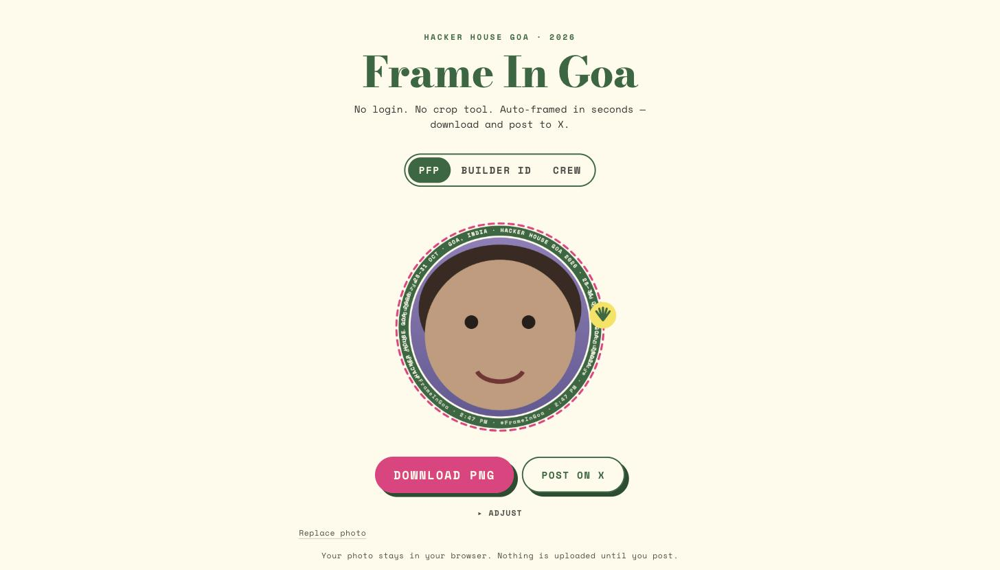

# Frame In Goa



**Live:** [hhg-framein-goa.vercel.app](https://hhg-framein-goa.vercel.app)
Built by **Nether Navigator** for the **Hacker House Goa 2026** Task #1 shortlisting challenge.

Drop a photo, get a branded HH Goa 2026 graphic in under two seconds — no login, no crop step,
no signup. Three formats: a **PFP frame** (circular, survives X's avatar crop), a **Builder ID**
card, and a **Crew Card** for 2–4 teammates in one frame. Download the real PNG, or post straight
to X with a caption and a share link whose preview shows the actual generated graphic.

## Architecture

Everything that ends up in a PNG is drawn by one `render(spec)` Canvas 2D pipeline
(`lib/render/`) — the on-screen preview and the downloaded file are the same code path, never a
styled `<div>` masquerading as the output. Sharing uploads the PNG to Vercel Blob only at the
moment someone taps "Post on X"; `/s/[id]` then serves real per-card OG metadata so the X link
preview shows the actual card, not a static fallback.

## Run locally

```bash
pnpm install
pnpm dev          # http://localhost:3000
```

Works with zero env vars — HEIC decoding, face-aware auto-framing, and rendering all run
client-side. Two optional vars unlock the share pipeline in dev (see `.env.example`):

```bash
BLOB_READ_WRITE_TOKEN=   # Vercel Blob — needed for /api/share to actually upload
NEXT_PUBLIC_SITE_URL=    # absolute origin for share links; defaults to localhost in dev
```

```bash
pnpm build && pnpm start   # production build + serve
pnpm test                  # vitest — render-contract + identity-generator tests
pnpm typecheck && pnpm lint
```

## Stack

Next.js 15 (App Router) · TypeScript strict · Tailwind CSS v4 · Canvas 2D rendering ·
`@mediapipe/tasks-vision` for face-aware auto-framing (lazy-loaded, falls back silently) ·
`heic-to` for iPhone photos (lazy-loaded) · Vercel Blob for share-link image hosting.

## Docs

The full spec — brand system, exact artboard geometry, architecture, build plan, decision log —
lives in [`docs/`](docs/) and [`CLAUDE.md`](CLAUDE.md).
